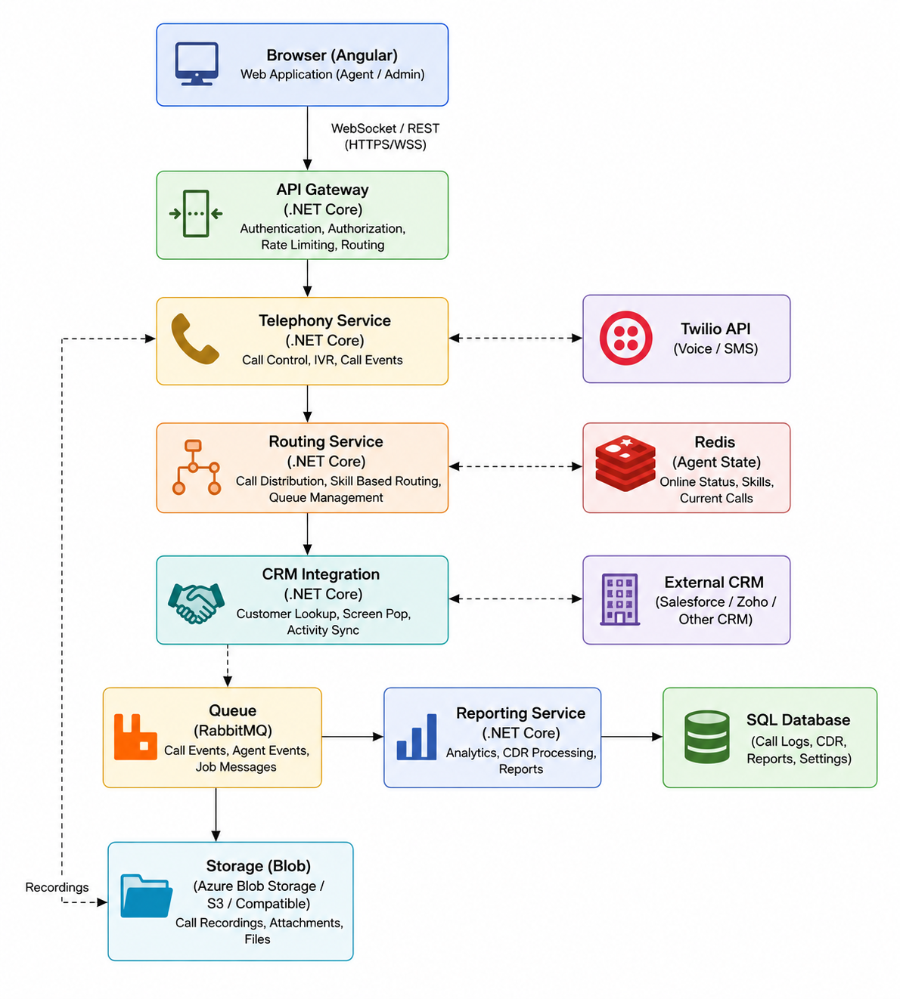

# Call Center Agent

## Section 1: Requirement Analysis

### 1.1 Business Goals
- Reduce dependency on third-party call center tool (cost savings, data control) 
- Enable deep integration with existing CRM
- Lay foundation for future AI capabilities (transcription, smart routing)
- Support 50+ agents now, scale to 500+ later 

### 1.2 User Stories
 - Agents :	Use system daily to make/receive calls
 - Supervisors : Monitor agent performance, view reports
 - Admin : Manage users, configure routing rules
 - CRM Users : Need integration with customer data
 - IT/Ops : Deploy, maintain, monitor infrastructure

### 1.3 Use Cases
 - Agent : Make/receive calls
 - Supervisor : Monitor agent performance, view reports
 - Admin : Manage users, configure routing rules
 - CRM Users : Need integration with customer data
 - IT/Ops : Deploy, maintain, monitor infrastructure

### 1.4 Assumptions 
 - CRM exposes REST APIs for customer data
 - Network latency is within acceptable limits (<100ms)
 - Telephony provider (e.g., Twilio) is reliable and well-documented
 - Agents have decent headsets and stable internet
 - Existing hardware can handle 50 concurrent calls

### 1.5 Functional Requirements
 - Agent : Make/receive calls
 - Supervisor : Monitor agent performance, view reports
 - Admin : Manage users, configure routing rules
 - CRM Users : Need integration with customer data
 - IT/Ops : Deploy, maintain, monitor infrastructure

### 1.6 Non-Functional Requirements
 - Scalability     : 50 to 500 concurrent agents 
 - Availability    : 99.9% uptime
 - Performance     : Less than 300ms for call setup 
 - Security        : HTTPS, JWT authentication, role-based access
 - User Experience : All action logged. 

### 1.7 Risk Analysis
 - High Risk: Security (JWT)
 - Telephony provider outage : Have a fallback provider or manual failover plan
 - CRM API rate limits : Implement caching and retry logic
 - Database bottleneck : Use read replicas and connection pooling
 - Agent training overhead : Provide clear UI and documentation

### 1.8 Risk Analysis 
 - AI-based call transcription
 - Sentiment analysis
 - Predictive dialer
 - Mobile app
 - Multi-language IVR 

### Section 2: Stakeholder Analysis (Question)
 - Which telephony provider should we use? (Twilio, Vonage, AWS Connect?)
 - Does the CRM have an API? If yes, what endpoints are available? Rate limits?
 - What is the average call duration? Peak concurrent call volume?
 - How long should call recordings be retained? Any compliance requirements (e.g., GDPR)?
 - Do we need multi-tenant support? (Different teams/departments?)
 - What are the key metrics for reporting? (Abandon rate, avg wait time, handle time?)
 - Are there existing identity providers (Azure AD, Okta) for single sign-on?
 - Who will be the primary users of the admin panel?
 - Is on-premise deployment required, or can we use cloud?
 - Do we need real-time agent monitoring dashboards?

### Section 3: MVP Definition
[In Scope (v1)]
- Agent login/logout : Basic access control
- Incoming call handling : Core business need
- Outgoing call from browser : Core business need
- Basic routing (round-robin) : Simple to implement, works for 50 agents
- Call recording : Required for quality/training
- Basic call logs :	Needed for troubleshooting
- Admin user management:	Add/remove agents
- CRM integration (read customer info) : Agents need context

[Cut from v1]
- AI transcription : High complexity, not critical
- Smart routing (ML-based) : Requires data & model training
- Advanced analytics dashboard : Can be added later
- Mobile support : Low initial user base
- IVR with multiple levels : Can be simple fallback first

## Prioritization Rationale
- Focus on core call flow first (making/receiving calls)
- Avoid features that require external ML/data science in v1
- Delay features that are nice-to-have but not blocker for go-live
- Minimize technical debt by keeping v1 simple but extensible

### Section 4: System Design

## 4.1 High-level Components 
- Agent Portal (Angular)	UI for agents to make/receive calls
- Admin Portal (Angular)	UI for supervisors/admins
- API Gateway (.NET Core)	Authenticate & route requests
- Telephony Service	(.NET Core)	Talk to Twilio, manage call sessions
- Routing Service (.NET Core)	Decide which agent gets a call
- CRM Integration Service (.NET Core)	Fetch customer data from CRM
- Reporting Service (.NET Core)	Store & retrieve call logs
- Database (SQL Server) Store users, logs, configs
- Cache	(Redis)	Store agent states, session data
- Queue	(RabbitMQ / Azure Service Bus)	Async tasks (recording processing, logs)
- Storage (Azure Blob / S3)	Store call recordings

## 4.1 4.2 Data Flow (Incoming Call)
- Customer calls → Twilio receives it
- Twilio sends webhook to your Telephony Service
- Telephony Service asks Routing Service for an available agent
- Routing Service checks Redis for agent availability & skills
- Agent is selected → Telephony Service connects agent's browser via WebRTC
- Call begins → Recording starts (streamed to storage)
- Call ends → Logs are saved to DB (async via queue)
- CRM Integration Service may update customer call history

## 4.3 Database Design (Key Tables)
- Client/Company (Id, Name, Email, Phone etc.)
- Agents (Id, Name, Email, SkillSet, Status, LastActive)
- Calls (Id, AgentId, CustomerPhone, Direction(In/Out), StartTime, EndTime, Duration, RecordingUrl)
- AgentSkills (AgentId, SkillName, ProficiencyLevel)
- CallLogs (Id, CallId, EventType, Timestamp, Metadata (JSON))
- Users (Id, Name, Role (Agent/Supervisor/Admin), HashedPassword)

## 4.4 Architecture Diagram (Textual)
[image here...]

### Section 5: Scalability Plan (50 to 500 Agents)
- Web Servers : Deploy multiple instances behind a load balancer (e.g., Azure Load Balancer)
- Telephony Service :	Stateless → can scale horizontally
- Routing Logic :	Use Redis for distributed caching of agent states to avoid DB hits
- Database : Use read replicas for reporting queries; connection pooling
- Queue : Use message queue to decouple async tasks (logs, recording processing)
- Auto-scaling : Configure Kubernetes HPA or Azure App Service auto-scale based on CPU/Memory
- Geographic : If agents are distributed, deploy in multiple regions with traffic manager
- Session Affinity : Use sticky sessions only if needed, otherwise stateless is better

### Section 6: AI-Ready Notes 
- Store raw audio: Save recordings in blob storage with a predictable naming convention (callId_timestamp.wav)
- Event-driven: Publish "CallEnded" event to queue; AI service can subscribe later
- Metadata enrichment: Store call context (agent, customer, duration, sentiment later) as JSON in DB
- Webhooks for AI: Expose webhooks that AI services can call to get call data
- Avoid tight coupling: Telephony service does NOT call AI directly — use events/queues
- Model serving: Keep separate microservice for AI inference, so it can scale independently

### Section 7: Deployment Strategy

## 7.1 CI/CD Pipeline (GitHub Actions / Azure DevOps)
- Trigger: Push to main branch
- Steps:
    - Build .NET Core project
    - Run unit/integration tests
    - Build Angular app
    - Publish artifacts
    - Deploy to Dev environment

## 7.2 Environments
- Dev (Developer testing): Auto deploy (on push). 
- Staging (QA/UAT testing): Manual approval for deploy.
- Production (Live users): Manual approval with rollback plan for deploy. 

## 7.3 Rollback Strategy
- Use deployment slots (Azure) or Kubernetes rolling updates
- Keep last 2 stable images in container registry
- If deployment fails health check → auto-rollback to previous version
- Database rollback scripts ready if schema changes needed

## 7.4 Backup & Disaster Recovery
- Database: Daily automated backup + point-in-time restore
- Recordings: Geo-redundant storage
- Configuration: Infrastructure as Code (Terraform/Bicep) to rebuild environment
- DR Plan: If primary region fails, failover to secondary region (active-passive)

## Monitoring & Notifying
- Application Insights / Prometheus for metrics (call success rate, latency, errors)
- Alerts for:
    - Call drop rate > 5%
    - API latency > 1s
    - Service down
    - Queue depth > threshold
